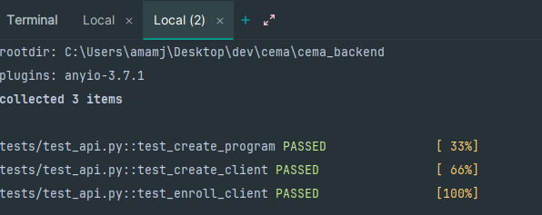

# Health Information System API

A FastAPI backend for managing health programs and client enrollments. This system allows for the creation of health programs, client registration, and program enrollment management.

## Live Demo

- Frontend: [https://cemafrontend.web.app/](https://cemafrontend.web.app/)
- API Documentation: [https://cema-health.onrender.com/docs](https://cema-health.onrender.com/docs)
- Frontend Code: [https://github.com/jesse-jacks0n/cema-frontend](https://github.com/jesse-jacks0n/cema-frontend)

## Demo Video

Check out system demo video:

https://github.com/jesse-jacks0n/cema-health/blob/master/demo.mkv

DEMO video also included in powerpoint presentation

## Test Coverage



## Features

- Create and manage health programs (TB, HIV, Malaria, etc.)
- Register new clients with personal information
- Enroll clients in multiple programs
- Search clients by name
- View detailed client profiles
- RESTful API with OpenAPI documentation
- SQLite database with SQLAlchemy ORM
- CORS enabled for frontend integration
- Basic unit tests

## Setup

1. Clone the repository:
   ```bash
   git clone https://github.com/jesse-jacks0n/cema-health.git
   cd cema-health
   ```
2. Create a virtual environment:
   ```bash
   python -m venv .venv
   source .venv/bin/activate  # On Windows: .venv\Scripts\activate
   ```
3. Install dependencies:
   ```bash
   pip install -r requirements.txt
   ```
4. Create a `.env` file with the following content:
   ```
   DATABASE_URL=sqlite:///./health_system.db
   SECRET_KEY=your-secret-key-for-jwt
   ALGORITHM=HS256
   ACCESS_TOKEN_EXPIRE_MINUTES=30
   ```

## Running the Application

1. Start the server:
   ```bash
   uvicorn main:app --reload --host 0.0.0.0 --port 8000
   ```
2. Access the API documentation at `http://localhost:8000/docs`

## API Endpoints

### Programs
- `POST /api/v1/programs/` - Create a new health program
- `GET /api/v1/programs/` - List all programs
- `PUT /api/v1/programs/{program_id}` - Update a program
- `DELETE /api/v1/programs/{program_id}` - Delete a program

### Clients
- `POST /api/v1/clients/` - Register a new client
- `GET /api/v1/clients/` - List all clients
- `GET /api/v1/clients/{client_id}` - Get client details
- `PUT /api/v1/clients/{client_id}` - Update client information
- `DELETE /api/v1/clients/{client_id}` - Delete a client
- `POST /api/v1/clients/search/` - Search clients by name

### Enrollments
- `POST /api/v1/enrollments/` - Enroll a client in a program
- `DELETE /api/v1/enrollments/` - Unenroll a client from a program

## Running Tests

```bash
pytest tests/
```

## Project Structure

```
.
├── app/
│   ├── __init__.py
│   ├── api.py         # API routes and endpoints
│   ├── crud.py        # Database CRUD operations
│   ├── database.py    # Database configuration
│   ├── models.py      # SQLAlchemy models
│   └── schemas.py     # Pydantic schemas
├── tests/
│   └── test_api.py    # API integration tests
├── .env               # Environment variables
├── main.py           # Application entry point
├── requirements.txt  # Python dependencies
├── demo.mkv         # Demo video
└── README.md        # Documentation
```

## Deployment

The API is deployed on [Render](https://render.com) with automatic deployments from the main branch. The frontend is hosted on Firebase Hosting.

## Technologies Used

- FastAPI - Modern Python web framework
- SQLAlchemy - SQL toolkit and ORM
- Pydantic - Data validation
- SQLite - Database
- Pytest - Testing framework
- Render - Backend hosting
- Firebase - Frontend hosting

## Contributing

1. Fork the repository
2. Create a feature branch
3. Commit your changes
4. Push to the branch
5. Create a Pull Request